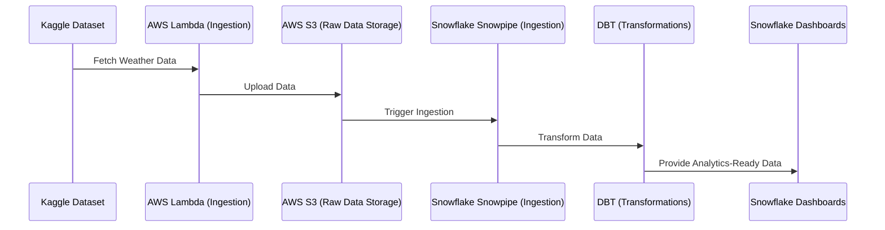

# 🌍 de-zoomcamp-final-2025

## **Overview**

This project focuses on building a scalable and efficient data engineering pipeline for the [**Global Weather Repository**](https://www.kaggle.com/datasets/nelgiriyewithana/global-weather-repository) dataset. The pipeline addresses challenges such as data inconsistencies, integration, scalability, and accessibility, enabling seamless analysis and decision-making for applications like climate research, weather forecasting, and disaster response.

---

## **Problem Description**

The **Global Weather Repository** dataset, available on Kaggle, provides a wealth of weather-related information from various locations over time. However, using this dataset directly poses several challenges:

1. **Data Inconsistencies**: Missing values, inaccuracies, and inconsistent formats hinder seamless analysis.
2. **Data Integration**: Combining weather data with other datasets (e.g., demographic or environmental data) is complex without a structured approach.
3. **Scalability**: Traditional systems struggle to handle the growing volume and complexity of weather data.
4. **Accessibility**: Stakeholders require data in specific formats or aggregated views, which is challenging without a robust pipeline.
---

## **Solution**

This project implements a robust data pipeline to address these challenges. The pipeline includes:

- **Automated Data Ingestion**: Fetches weather data from Kaggle and uploads it to an AWS S3 bucket.
- **Data Cleaning and Preprocessing**: Handles missing or inconsistent data to ensure quality.
- **Data Transformation**: Converts raw data into standardized formats for analysis.
- **Integration**: Combines weather data with other datasets to enrich insights.
- **Scalable Storage**: Stores data in Snowflake, a cloud-based data warehouse.
- **Analytics-Ready Outputs**: Prepares data for dashboards, visualizations, and machine learning models.

---

## **Architecture**

### **High-Level Workflow**

1. **Data Ingestion**:
   - A Lambda function fetches weather data from Kaggle and uploads it to an S3 bucket.
   - S3 notifications trigger downstream processes.

2. **Data Processing**:
   - Snowflake ingests raw data using Snowpipe.
   - DBT transforms the data into analytics-ready tables.

3. **Visualization**:
   - Dashboards in Snowflake provide insights into monthly weather trends and air quality metrics.

---

### **Block Diagram**



---

## **Key Features**

- **Automated Data Ingestion**:
  - Fetches weather data daily using AWS Lambda.
  - Automatically ingests data into Snowflake using Snowpipe.

- **Data Cleaning and Transformation**:
  - DBT ensures consistent column names, formats, and values.
  - Handles deduplication and monthly aggregations.

- **Scalable Infrastructure**:
  - Uses AWS S3 for raw data storage and Snowflake for scalable querying.

- **Interactive Dashboards**:
  - Snowflake dashboards visualize monthly weather trends and air quality metrics.

---

## **How to Run the Project**

### **1. Prerequisites**
- AWS account with S3, Lambda, and IAM configured.
- Snowflake account with necessary roles and permissions.
- Docker installed for running Terraform and DBT commands.

### **2. Setup Steps**
1. **AWS Infrastructure**:
   - Use Terraform to provision S3, Lambda, and IAM resources.
   - Configure S3 notifications to trigger downstream processes.

2. **Snowflake Setup**:
   - Use Terraform to create databases, schemas, and Snowpipes.
   - Grant necessary roles and permissions.

3. **DBT Pipeline**:
   - Run DBT models to transform raw data into analytics-ready tables.

4. **Dashboard**:
   - Use Snowflake to create interactive dashboards for weather analysis.

---

## **Repository Structure**

```
├── aws/
│   ├── terraform/          # Terraform scripts for AWS infrastructure
│   ├── docker/             # Docker setup for Lambda ingestion
├── dbt/
│   ├── models/             # DBT models for data transformation
│   ├── macros/             # DBT macros for reusable SQL logic
├── snowflake/
│   ├── terraform/          # Terraform scripts for Snowflake setup
│   ├── dashboard/          # Dashboard scripts and documentation
├── README.md               # Project documentation
```

---

## **Future Enhancements**

1. **Real-Time Data Processing**:
   - Enable real-time ingestion and transformation for weather forecasting.

2. **Additional Integrations**:
   - Combine weather data with demographic or environmental datasets.

3. **Advanced Analytics**:
   - Implement machine learning models for predictive analytics.

---

## **Contributors**

- **Arjun R** - Data Engineer

---
