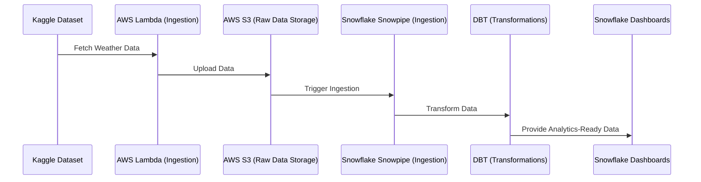

# 🌍 de-zoomcamp-final-2025

## **Overview**

This project focuses on building a scalable and efficient data engineering pipeline for the [**Global Weather Repository**](https://www.kaggle.com/datasets/nelgiriyewithana/global-weather-repository) dataset. The pipeline addresses challenges such as data inconsistencies, integration, scalability, and accessibility, enabling seamless analysis and decision-making for applications like climate research, weather forecasting, and disaster response.

---

## **Problem Description**

The **Global Weather Repository** dataset, available on Kaggle, provides a wealth of weather-related information from various locations over time. However, using this dataset directly poses several challenges:

1. **Data Inconsistencies**: Missing values, inaccuracies, and inconsistent formats hinder seamless analysis.
2. **Data Integration**: Combining weather data with other datasets (e.g., demographic or environmental data) is complex without a structured approach.
3. **Scalability**: Traditional systems struggle to handle the growing volume and complexity of weather data.
4. **Accessibility**: Stakeholders require data in specific formats or aggregated views, which is challenging without a robust pipeline.

---

## **Solution**

This project implements a robust, cloud-native data pipeline to address these challenges. Key components of the pipeline include:

- **Automated Data Ingestion**: Fetches weather data from Kaggle and uploads it to an AWS S3 bucket.
- **Infrastructure as Code (IaC)**: Uses **Terraform** to provision AWS and Snowflake resources.
- **Data Cleaning and Preprocessing**: Handles missing or inconsistent data to ensure high quality.
- **Data Transformation**: Converts raw data into standardized, analytics-ready formats.
- **Data Integration**: Combines weather data with other potential datasets for deeper insights.
- **Scalable Storage and Querying**: Leverages Snowflake for massive scalability and performance.
- **Analytics-Ready Outputs**: Prepares data for dashboards, visualizations, and advanced modeling.

---

## **Architecture**

### **High-Level Workflow**

1. **Data Ingestion**:
   - AWS Lambda function fetches weather data from Kaggle and uploads it to an S3 bucket.
   - S3 bucket events trigger data ingestion workflows automatically.

2. **Data Processing**:
   - Snowflake Snowpipe ingests raw data from S3 in near real-time.
   - DBT transforms and models the data into cleaned, aggregated tables.

3. **Visualization**:
   - Snowflake Dashboards provide interactive insights into weather and air quality metrics.

---

### **Block Diagram**



---

## **Tech Stack**

- **AWS S3**: Scalable raw data storage.
- **AWS Lambda**: Automated serverless ingestion from Kaggle.
- **Snowflake**: Cloud-native data warehouse for storage and analytics.
- **DBT**: Data transformation and modeling framework.
- **Terraform**: Infrastructure as Code (IaC) for AWS and Snowflake resource provisioning.
- **Docker**: Local environment setup and reproducibility.
- **Kaggle API**: Access to external weather datasets.
- **Snowflake Dashboards**: Interactive data visualization.

---

## **Key Features**

- **Automated Data Ingestion**:
  - AWS Lambda function fetches daily weather data.
  - Uploads to AWS S3, automatically triggering Snowpipe ingestion into Snowflake.

- **Infrastructure as Code**:
  - **Terraform** scripts manage the provisioning of:
    - AWS resources (S3, Lambda, IAM roles, S3 events).
    - Snowflake resources (databases, schemas, stages, pipes, roles, warehouses).

- **Data Cleaning and Transformation**:
  - DBT ensures consistency in column names, data types, and value formats.
  - Deduplication and aggregation of weather data by month and region.

- **Scalable, Cost-Effective Architecture**:
  - S3 + Snowflake enables elastic scalability and optimized query performance.

- **Interactive Dashboards**:
  - Snowflake dashboards provide insights on temperature, precipitation, air quality, and extreme weather events.

---

## **How to Run the Project**

### **1. Prerequisites**
- AWS account with S3, Lambda, and IAM permissions.
- Snowflake account with admin access for database and user management.
- Docker installed locally to execute Terraform and DBT operations.
- Kaggle account and API token configured.

### **2. Setup Steps**
1. **AWS Infrastructure**:
   - Navigate to `/aws/terraform/`.
   - Run Terraform scripts to provision:
     - S3 bucket
     - Lambda function
     - IAM roles and policies
     - S3 Event Notifications
   - Deploy Lambda ingestion function using Docker.

2. **Snowflake Setup**:
   - Navigate to `/snowflake/terraform/`.
   - Apply Terraform scripts to provision:
     - Databases
     - Schemas
     - Stages
     - Snowpipes
     - Warehouses
   - Grant appropriate Snowflake roles and permissions.

3. **DBT Pipeline**:
   - Navigate to `/dbt/`.
   - Configure your `profiles.yml` for Snowflake connection.
   - Run `dbt run` to build models and `dbt test` to validate transformations.

4. **Dashboard Creation**:
   - Use Snowflake worksheets and dashboarding features to visualize and explore processed data.

---

## **Repository Structure**

```
├── aws/
│   ├── terraform/          # Terraform scripts for AWS (S3, Lambda, IAM)
│   ├── docker/             # Docker setup for packaging Lambda functions
├── dbt/
│   ├── models/             # DBT models (raw to cleaned tables)
│   ├── macros/             # DBT macros for reusable SQL logic
├── snowflake/
│   ├── terraform/          # Terraform scripts for Snowflake resources
│   ├── dashboard/          # Dashboard configuration and sample queries
├── README.md               # Project documentation
```

---

## **Future Enhancements**

1. **Real-Time Streaming**:
   - Integrate AWS Kinesis or Kafka to allow real-time weather data ingestion and near-instant transformations.

2. **Advanced Analytics**:
   - Develop machine learning models for predictive analytics on climate trends and extreme events.

3. **Data Enrichment**:
   - Integrate demographic, environmental, and economic datasets for multidimensional insights.

4. **Monitoring and Observability**:
   - Implement logging, alerting (AWS CloudWatch), and data quality checks (DBT tests) for robust monitoring.

---

## **Contributors**

- **Arjun R** - Data Engineer

---