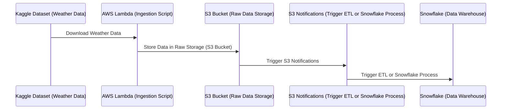
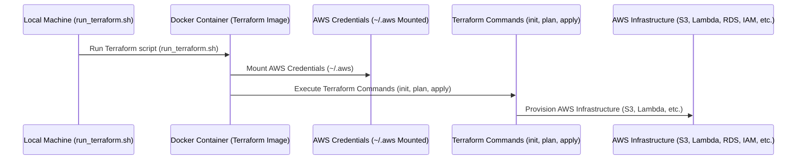

# Terraform Workflow for AWS Infrastructure

This Terraform configuration provisions the AWS infrastructure required for a weather data pipeline. The infrastructure supports data ingestion, processing, and integration with Snowflake for analytics.

---

## High-Level Overview of the Terraform Process

1. **Infrastructure Provisioning**:
   - Terraform provisions the required AWS resources, including:
     - **S3 Bucket**: Stores raw and processed weather data.
     - **ECR Repository**: Hosts the Docker image for the Lambda function.
     - **Lambda Function**: Ingests weather data from Kaggle and uploads it to S3.
     - **IAM Roles and Policies**: Grants permissions for Lambda, Snowflake, and other services.
     - **EventBridge Rule**: Schedules the Lambda function to run daily at 6 AM IST.
     - **S3 Notifications**: Triggers downstream processes when new data is added to the S3 bucket.

2. **Data Ingestion**:
   - The Lambda function fetches weather data from Kaggle and uploads it to the S3 bucket.
   - The function is triggered daily by an EventBridge rule.

3. **Data Processing**:
   - S3 bucket notifications can trigger downstream processes, such as ETL pipelines or Snowflake integrations.

4. **Snowflake Integration**:
   - An IAM role and policy are created to allow Snowflake to access the S3 bucket for data ingestion.

---

## Block Diagram of the Terraform Workflow




---

## Key Features of the Workflow

- **Automated Data Ingestion**:
  - The Lambda function fetches weather data daily and uploads it to S3.

- **Event-Driven Architecture**:
  - S3 notifications trigger downstream processes, enabling real-time data workflows.

- **Snowflake Integration**:
  - IAM roles and policies allow Snowflake to securely access the S3 bucket for analytics.

- **Scalable and Secure**:
  - AWS services like S3, Lambda, and IAM ensure scalability and secure access to resources.


# run_terraform.sh

This script (`run_terraform.sh`) is designed to simplify the process of running Terraform commands inside a Docker container. It ensures a consistent and isolated environment for managing AWS infrastructure using Terraform, without requiring Terraform to be installed locally.

---

## High-Level Overview of the Terraform Process

1. **Dockerized Terraform Environment**:
   - The script uses the official HashiCorp Terraform Docker image to run Terraform commands.
   - This ensures that the correct version of Terraform is used and avoids dependency conflicts on the host machine.

2. **AWS Authentication**:
   - The script mounts the local AWS credentials directory (`~/.aws`) into the Docker container.
   - This allows Terraform to authenticate with AWS services using the credentials configured on the host machine.

3. **Infrastructure Management**:
   - Terraform commands (e.g., `init`, `plan`, `apply`) are executed inside the container.
   - These commands are used to provision, update, or destroy AWS resources as defined in the Terraform configuration files.

4. **Automatic Cleanup**:
   - The Docker container is automatically removed after the command is executed, ensuring no leftover containers clutter the system.

---

## Block Diagram of the Terraform Workflow



---

## How to Use the Script

1. **Save the Script**:
   - Save the `run_terraform.sh` script in the same directory as your Terraform configuration files.

2. **Make the Script Executable**:
   - Run the following command to make the script executable:
     ```bash
     chmod +x run_terraform.sh
     ```

3. **Run Terraform Commands**:
   - Use the script to run Terraform commands. For example:
     ```bash
     ./run_terraform.sh init
     ./run_terraform.sh plan
     ./run_terraform.sh apply
     ```

4. **Monitor Infrastructure**:
   - Use the AWS Management Console or CLI to monitor the provisioned resources.

---

This workflow ensures a streamlined and reliable process for managing AWS infrastructure using Terraform, while leveraging Docker for isolation and consistency.