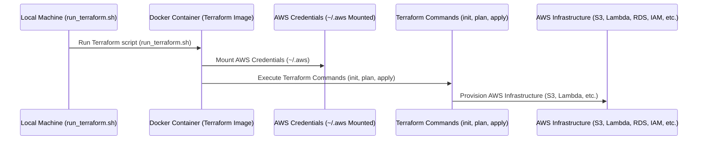

# run_terraform.sh

This script (`run_terraform.sh`) is designed to simplify the process of running Terraform commands inside a Docker container. It ensures a consistent and isolated environment for managing AWS infrastructure using Terraform, without requiring Terraform to be installed locally.

---

## High-Level Overview of the Terraform Process

1. **Dockerized Terraform Environment**:
   - The script uses the official HashiCorp Terraform Docker image to run Terraform commands.
   - This ensures that the correct version of Terraform is used and avoids dependency conflicts on the host machine.

2. **AWS Authentication**:
   - The script mounts the local AWS credentials directory (`~/.aws`) into the Docker container.
   - This allows Terraform to authenticate with AWS services using the credentials configured on the host machine.

3. **Infrastructure Management**:
   - Terraform commands (e.g., `init`, `plan`, `apply`) are executed inside the container.
   - These commands are used to provision, update, or destroy AWS resources as defined in the Terraform configuration files.

4. **Automatic Cleanup**:
   - The Docker container is automatically removed after the command is executed, ensuring no leftover containers clutter the system.

---

## Block Diagram of the Terraform Workflow



---

## Key Features of the Workflow

- **Consistency**:
  - Ensures Terraform commands are executed in a controlled and consistent environment.

- **AWS Integration**:
  - Leverages local AWS credentials for seamless authentication with AWS services.

- **Ease of Use**:
  - Simplifies Terraform usage by encapsulating commands in a single script.

- **Automatic Cleanup**:
  - Prevents clutter by removing the Docker container after execution.

---

## How to Use the Script

1. **Save the Script**:
   - Save the `run_terraform.sh` script in the same directory as your Terraform configuration files.

2. **Make the Script Executable**:
   - Run the following command to make the script executable:
     ```bash
     chmod +x run_terraform.sh
     ```

3. **Run Terraform Commands**:
   - Use the script to run Terraform commands. For example:
     ```bash
     ./run_terraform.sh init
     ./run_terraform.sh plan
     ./run_terraform.sh apply
     ```

4. **Monitor Infrastructure**:
   - Use the AWS Management Console or CLI to monitor the provisioned resources.

---

This workflow ensures a streamlined and reliable process for managing AWS infrastructure using Terraform, while leveraging Docker for isolation and consistency.