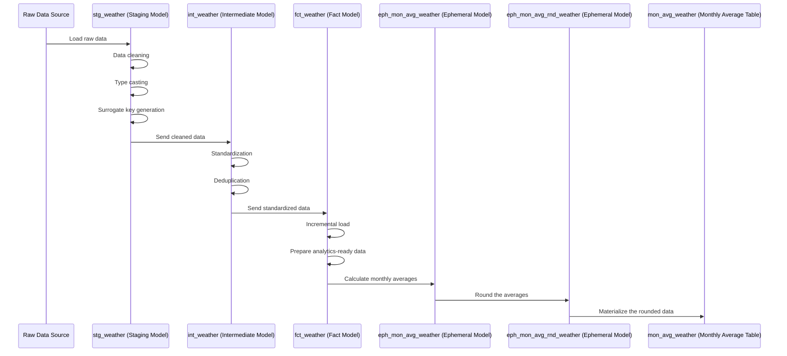

Got it!  
You have **two ephemeral models** now:  
- `eph_mon_avg_weather` (monthly averages)  
- `eph_mon_avg_rnd_weather` (rounding the monthly averages)  

And your final table `mon_avg_weather` materializes the rounded result.

Here’s your **full updated markdown**, cleanly integrating everything, including the second ephemeral model:

---

# DBT Weather Data Pipeline

This DBT project processes and transforms raw weather data into clean, structured, and analytics-ready tables. The pipeline is designed to handle data ingestion, cleaning, standardization, and aggregation for downstream analytics and reporting.

---

## High-Level Overview of the DBT Process

1. **Raw Data Source**:
   - The raw weather data is ingested from the `kaggle_datasets.weather_dataset_raw` source table.

2. **Staging Models (`stg_weather`)**:
   - The raw data is cleaned and standardized.
   - Columns are renamed, formatted, and type-cast for consistency.
   - A surrogate key (`rec_id`) is generated, and duplicate records are handled.

3. **Intermediate Models (`int_weather`)**:
   - The staging data is further processed to standardize country and city names.
   - Deduplication is performed by selecting the first record for each combination of `date`, `country`, and `city`.
   - The cleaned data is prepared for use in fact tables.

4. **Fact Models (`fct_weather`)**:
   - The intermediate data is loaded into a fact table.
   - Incremental loading ensures only new or updated data is processed.
   - The fact table serves as the final dataset for analytics and reporting.

5. **Ephemeral Model (`eph_mon_avg_weather`)**:
   - Calculates the **monthly average** of key weather and air quality metrics.
   - Uses window functions to compute averages partitioned by `country`, `city`, and `month`.
   - Prepares summarized weather data for further transformation.

6. **Ephemeral Model (`eph_mon_avg_rnd_weather`)**:
   - Rounds the monthly average metrics from `eph_mon_avg_weather` to two decimal places.
   - Ensures consistent and clean metric formatting before materialization.

7. **Monthly Average Table (`mon_avg_weather`)**:
   - Materializes the rounded monthly averages into a physical table.
   - Provides a final, structured dataset ready for dashboards and reporting.

---

## Block Diagram of Models



---

## Key Features of the Pipeline

- **Data Cleaning and Standardization**:
  - Ensures consistent column names, formats, and values.
  - Handles multilingual and inconsistent country/city names.

- **Deduplication**:
  - Removes duplicate records to ensure data accuracy.

- **Incremental Loading**:
  - Optimizes performance by processing only new or updated data.

- **Monthly Aggregations**:
  - Provides monthly-level summaries of key weather and air quality metrics.

- **Ephemeral Transformation**:
  - Lightweight transformations (averaging and rounding) without persisting unnecessary intermediate tables.

- **Analytics-Ready Data**:
  - Final dataset prepared for dashboards, visualizations, and advanced analytics.

---

## How to Run the Pipeline

1. **Set Up DBT**:
   - Ensure DBT is installed and configured with your Snowflake connection.

2. **Run Models**:
   - Execute the models in sequence:
     ```bash
     dbt run --select stg_weather
     dbt run --select int_weather
     dbt run --select fct_weather
     dbt run --select eph_mon_avg_weather
     dbt run --select eph_mon_avg_rnd_weather
     dbt run --select mon_avg_weather
     ```

3. **Test Models**:
   - Validate the models using DBT tests:
     ```bash
     dbt test
     ```

4. **Incremental Updates**:
   - For incremental updates, simply run:
     ```bash
     dbt run --select fct_weather
     ```

---

## Model Summary Table

| Model Name              | Materialization | Purpose |
| ------------------------ | --------------- | ------- |
| `stg_weather`            | View             | Clean and standardize raw data |
| `int_weather`            | View             | Standardize names, deduplicate |
| `fct_weather`            | Incremental Table| Final weather fact table |
| `eph_mon_avg_weather`    | Ephemeral        | Calculate monthly averages |
| `eph_mon_avg_rnd_weather`| Ephemeral        | Round monthly averages |
| `mon_avg_weather`        | Table            | Materialized monthly average dataset |

---

This pipeline ensures efficient and reliable processing of weather data, making it ready for advanced analytics and reporting.

##### Terraform not supported in trial

---