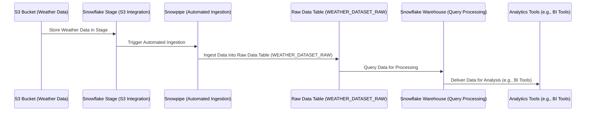
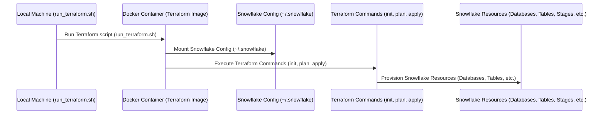

# Snowflake Terraform Workflow for Weather Data Pipeline

This Terraform configuration provisions the Snowflake infrastructure required for the weather data pipeline. It automates the creation of databases, schemas, tables, stages, and Snowpipes to enable seamless data ingestion, processing, and analytics.

---

## High-Level Overview of the Snowflake Terraform Process

1. **Database and Schema Setup**:
   - A Snowflake database (`KAGGLE_DATASETS`) and schema (`WEATHER`) are created to organize the weather data.

2. **Role and User Management**:
   - A `DATA_ENGINEER_ROLE` is created with appropriate privileges to manage the database, schema, and other resources.
   - A `DATA_ENGINEER` user is created and assigned the `DATA_ENGINEER_ROLE`.

3. **Warehouse Provisioning**:
   - A Snowflake warehouse (`DATA_ENGINEER_WAREHOUSE`) is created to execute queries and manage data processing.

4. **S3 Integration**:
   - A Snowflake storage integration is configured to securely access weather data stored in an S3 bucket.

5. **File Format and Stage**:
   - A CSV file format is defined for parsing weather data files.
   - An external stage is created to link the S3 bucket to Snowflake.

6. **Table Creation**:
   - A raw data table (`WEATHER_DATASET_RAW`) is created to store ingested weather data.

7. **Snowpipe for Automated Ingestion**:
   - A Snowpipe is configured to automatically ingest data from the S3 stage into the raw data table.

8. **Granting Privileges**:
   - Privileges are granted to the `DATA_ENGINEER_ROLE` for managing the database, schema, warehouse, stage, file format, table, and Snowpipe.

---

## Block Diagram of the Snowflake Workflow




---

## Key Features of the Workflow

- **Automated Data Ingestion**:
  - Snowpipe automatically ingests data from the S3 bucket into the raw data table.

- **Secure S3 Integration**:
  - A Snowflake storage integration securely connects Snowflake to the S3 bucket.

- **Role-Based Access Control**:
  - The `DATA_ENGINEER_ROLE` ensures secure and controlled access to Snowflake resources.

- **Scalable Query Processing**:
  - The Snowflake warehouse provides scalable compute resources for data processing and analytics.

- **Structured Data Storage**:
  - The raw data table organizes ingested weather data for downstream processing.

---

This Terraform configuration ensures a streamlined and automated process for managing Snowflake infrastructure, enabling efficient data ingestion, processing, and analytics for the weather data pipeline.

# run_terraform.sh

This script (`run_terraform.sh`) simplifies the process of running Terraform commands inside a Docker container. It ensures a consistent and isolated environment for managing Snowflake infrastructure using Terraform, without requiring Terraform to be installed locally.

---

## High-Level Overview of the Terraform Process

1. **Dockerized Terraform Environment**:
   - The script uses the official HashiCorp Terraform Docker image to run Terraform commands.
   - This ensures that the correct version of Terraform is used and avoids dependency conflicts on the host machine.

2. **Snowflake Authentication**:
   - The script mounts the local Snowflake credentials directory (`~/.snowflake`) into the Docker container.
   - This allows Terraform to authenticate with Snowflake using the credentials configured on the host machine.

3. **Infrastructure Management**:
   - Terraform commands (e.g., `init`, `plan`, `apply`) are executed inside the container.
   - These commands are used to provision, update, or destroy Snowflake resources as defined in the Terraform configuration files.

4. **Automatic Cleanup**:
   - The Docker container is automatically removed after the command is executed, ensuring no leftover containers clutter the system.

---

## Block Diagram of the Terraform Workflow


---



---

## How to Use the Script

1. **Save the Script**:
   - Save the `run_terraform.sh` script in the same directory as your Terraform configuration files.

2. **Make the Script Executable**:
   - Run the following command to make the script executable:
     ```bash
     chmod +x run_terraform.sh
     ```

3. **Run Terraform Commands**:
   - Use the script to run Terraform commands. For example:
     ```bash
     ./run_terraform.sh init
     ./run_terraform.sh plan
     ./run_terraform.sh apply
     ```

4. **Monitor Resources**:
   - Use the Snowflake web interface or CLI to monitor the provisioned resources.

---

This workflow ensures a streamlined and reliable process for managing Snowflake infrastructure using Terraform, while leveraging Docker for isolation and consistency.