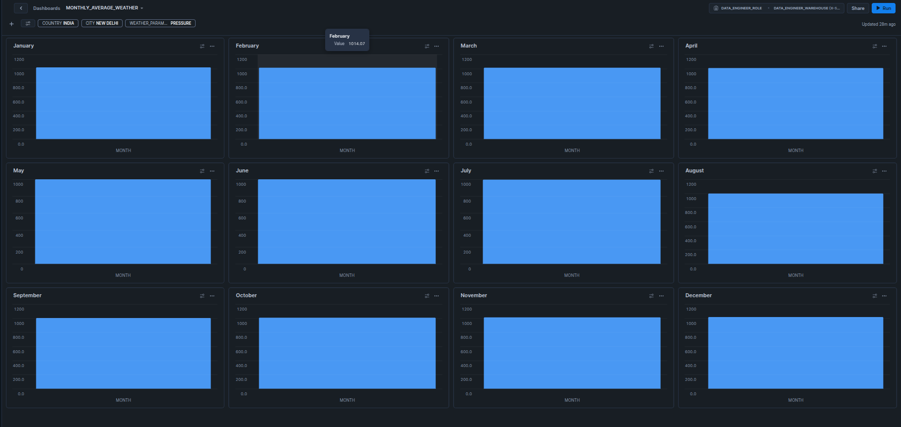

# 📊 Dashboard Documentation: **Monthly Average Weather Analysis**

## Overview
This dashboard provides a detailed visual analysis of **monthly average weather and air quality parameters** for a **selected city and country**.  
It is designed to help users monitor and detect seasonal trends across a wide range of environmental factors.

---

## 📍 Filters and Selections
- **Country:** Select from a list of available countries.
- **City:** Select from a list of available cities (filtered based on selected country).
- **Weather Parameters (Selectable):**
  - TEMPERATURE
  - PRESSURE
  - VISIBILITY
  - WIND_SPEED
  - PRECIPITATION
  - HUMIDITY
  - FEELS_LIKE
  - CLOUD_COVER
  - MOON_ILLUMINATION
  - UV
  - GUST
  - AQ_OZONE
  - AQ_US_EPA_INDEX
  - AQ_NO2
  - AQ_PM2_5
  - AQ_GB_DEFRA_INDEX
  - AQ_PM10
  - AQ_SO2
  - AQ_CO

---

## 📈 Visual Layout
The dashboard is organized into **12 tiles**, each representing one month of the year:

| Month       | Chart Type    | Metric                 |
|-------------|----------------|------------------------|
| January     | Bar Chart      | Selected Parameter Average |
| February    | Bar Chart      | Selected Parameter Average |
| March       | Bar Chart      | Selected Parameter Average |
| April       | Bar Chart      | Selected Parameter Average |
| May         | Bar Chart      | Selected Parameter Average |
| June        | Bar Chart      | Selected Parameter Average |
| July        | Bar Chart      | Selected Parameter Average |
| August      | Bar Chart      | Selected Parameter Average |
| September   | Bar Chart      | Selected Parameter Average |
| October     | Bar Chart      | Selected Parameter Average |
| November    | Bar Chart      | Selected Parameter Average |
| December    | Bar Chart      | Selected Parameter Average |

**Note:** The displayed metric dynamically updates based on the selected country, city, and parameter.

